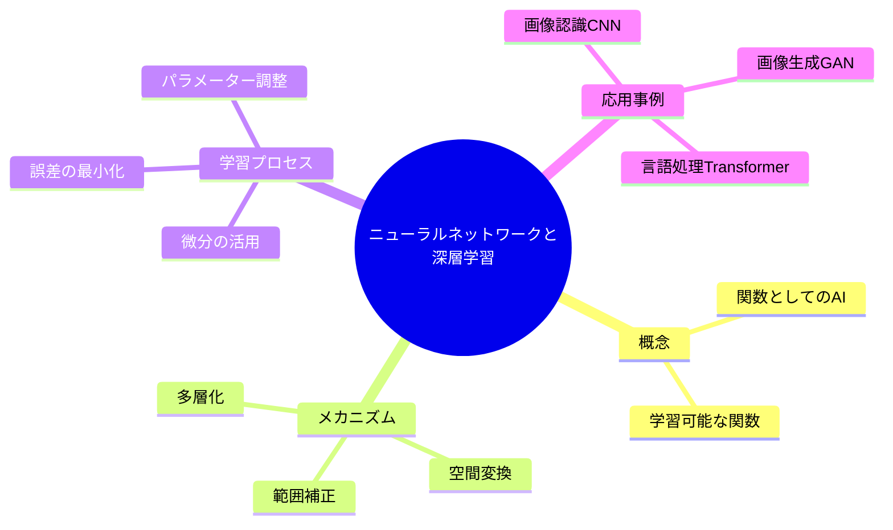

## 0. 講義全体のマインドマップ

---

### 1. エグゼクティブ・サマリー

本講義は、複雑な事象（インフルエンザ診断から画像認識まで）を解き明かすための「学習可能な関数」としてのニューラルネットワークの本質を解説するものです。**「空間変換」と「範囲補正」という単純な操作を多層に重ねることで、データ構造を解きほぐし、複雑な課題を解決可能にする**という設計思想が最大の結論です。

---

### 2. 構造化された要点整理 (Hierarchical Key Points)

#### ① ニューラルネットワークの本質

- **関数 $y = f(x)$**：入力（体温、画像、文章）に対して出力（診断結果、物体名、翻訳文）を返す仕組み。
    
- **学習の定義**：あらかじめ与えられた関数を使うのではなく、大量のデータと正解（教師データ）を用いて、関数を適切な形に**修正・最適化**していくプロセス。
    

#### ② データの加工メカニズム（数理的側面）

- **空間変換（線形代数）**：**行列 $W$（重み）** を用いてデータの座標軸を変換し、分布を変える。
    
- **範囲補正（活性化関数）**：負の値をゼロにする等の処理により、データの非線形性を生み出す。
    
- **多層化（ディープ化）**：空間変換を何十回、何百回と繰り返すことで、極めて複雑な境界線を持つ分類が可能になる。
    

#### ③ 学習のアルゴリズム

- **パラメーター**：各ニューロンの個性を決める **重み $W$** と **バイアス $B$**。
    
- **勾配降下法**：誤差（理想とのズレ）を最小化するために、**微分**を用いて「誤差の谷底」を探索する。
    
- **計算リソース**：膨大なパラメーターの学習には、高性能な計算機と大規模なオープンデータが不可欠である。
    

#### ④ 最先端の応用技術

|**分野**|**主要技術**|**特徴**|
|---|---|---|
|**画像認識**|**CNN** (畳み込みニューラルネットワーク)|フィルター加工（畳み込み）を繰り返し、特徴を抽出する。|
|**画像生成**|**GAN** (敵対的生成ネットワーク)|2つのネットワークを競わせ、実物に近い画像を生成する。|
|**自然言語処理**|**Transformer** / **GPT**|全単語間の相互関係（コンテキスト）を計算し、高度な文章生成を行う。|

---

### 3. 「ファインマン・テクニック」による解説

**テーマ：ニューラルネットワークによる「データの加工」**

複雑なデータを分類するのは、バラバラに置かれた「赤い丸」と「青いバツ」が書かれた**クシャクシャの紙**を、ハサミで一直線に切って分けるようなものです。

普通に切ろうとすると、ハサミを複雑に動かさなければならず、非常に困難です。しかし、ニューラルネットワークはこう考えます。

「切るのが難しいなら、先に紙を適切に折りたたんでしまえばいい」

1. まず、紙を特定の角度で折ります（これが**空間変換**です）。
    
2. 次に、はみ出た部分を整えます（これが**範囲補正**です）。
    
3. これを何度も繰り返すと、どんなに複雑に散らばっていた「丸」と「バツ」も、最終的には重なり合い、**ハサミを一度スッと通すだけ（シンプルな直線）**で完璧に分けることができるようになります。
    

つまり、ディープラーニングとは「ハサミの技術を磨くこと」ではなく、**「紙の折り方を極めること」**なのです。

---

### 4. 知識定着のためのセルフチェック・クイズ

1. **【概念の理解】** 直線では分類できない「山形」のデータ分布を分類するために、ニューラルネットワークは内部でデータをどのように扱っていますか？「次元」という言葉を使って説明してください。
    
2. **【仕組みの理解】** 学習プロセスにおいて「微分」が「旅のパートナー」に例えられているのはなぜですか？誤差の地図をイメージして、その役割を説明してください。
    
3. **【応用の思考】** 最新の自然言語処理モデル（Transformer）が、従来のモデルよりも「文脈」を理解できるのは、単語間の関係性をどのように計算しているからですか？
    

---

### 5. 実践へのマッピング：今日からのステップ

1. **リソースの確認（今日）**
    
    - 講義で触れられた「無償公開されている学習済みモデル」を探してみる（例：Hugging FaceやGitHubで、自分の興味がある分野のモデルを検索）。
        
2. **数学的基礎の再確認（今週）**
    
    - ニューロンの基本式である $y = \phi(Wx + B)$ における、行列 $W$ と内積の意味を、改めて中学・高校数学の範囲から見直す。
        
3. **実践的な実験（来週以降）**
    
    - プログラミングに馴染みがあれば、Google Colabなどを用いて、公開されている画像認識や文章生成のデモを実際に動かし、パラメーターによる出力の変化を観察する。
        

---
![[折り紙のトリック：ディープラーニングの本当の仕組み.mp4]]