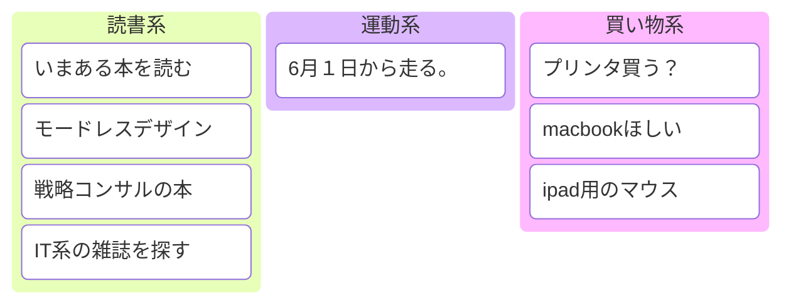

#todo 

# リスト

# タイムテーブル

| time | to  | minutes |
| ---- | --- | ------- |
| 6:00 | 起きる | 0       |
| 7:00 | jog | 60      |
| 9:00 | 読書  | 120     |
|      |     |         |
# 帰省準備
1. 新幹線の予約
2. お土産
3. 持って帰るもの
	1. 韓国の地下鉄のICカード
4. 