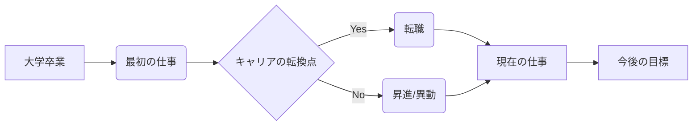

---
tags:
  - 自分史
  - 自己紹介
  - SWOT分析
  - 幼少期
  - 家族構成
  - 経済状況
  - 少年野球
  - 学生時代
  - 学校生活
  - 部活動
  - 社会人時代
  - 就職活動
  - 職場環境
  - キャリア
  - 転職
  - 昇進
  - プライベート
  - スキル
  - 実績
  - 職務経歴
  - 資格
  - プロジェクト
  - 転職活動
  - 動機
  - キャリア目標
  - 将来展望
  - 振り返り
  - 強み
  - 弱み
  - 人生における重要な出来事
  - 付録
  - 写真
  - 関連資料
  - Mermaid図
  - キャリアパス
  - スキルマップ
---
## 自分史フォーマット

## 1. はじめに

### 自己紹介（簡単なプロフィール、生まれた場所と時期など）
- it's me 
### この自分史を書く目的
- 自分史を紐解くことでいまいちど自分のSWOT分析をして現状を把握し、今後の展開に役立てる。

## 2. 幼少期（～小学校卒業頃）

### 生まれた環境（家族構成、住んでいた場所、経済状況など）
- 群馬県多野郡万場町に生まれる。
- ２歳で同県佐波郡玉村町に転居
- ５人家族だが父親は万場町に残ったため、母と兄と姉と共に過ごす
	- 母は忙しくあまり面倒を見てもらった記憶がない。
	- 兄はよく喋り面倒見も良かった。
	- 姉も可愛がってくれた。
### 幼少期の思い出（楽しかったこと、辛かったこと、印象に残っている出来事など）
- 少年野球の思い出
### 当時の自分の性格や特徴

## 3. 学生時代（小学校卒業～大学卒業頃）

### 学校生活（友達関係、部活動、勉強など）
### 重要な出来事（進学、転校、アルバイトなど）
### 成長や変化（考え方、価値観、目標など）

## 4. 社会人時代（大学卒業～現在）

### 就職活動と最初の仕事
### 職場の環境と人間関係
### 仕事上の成功体験と失敗体験
### キャリアの変化（転職、昇進など）
### プライベート（結婚、家族、趣味など）

## 5. スキルと実績

### 職務経歴の概要
### 具体的なスキル（技術、言語、資格など）
### プロジェクトや業務での実績（定量的な成果を含む）

## 6. 転職活動への動機

### 転職を考えるようになった背景
### 今回の転職で実現したいこと
### どのような企業や職種に興味があるか

## 7. 今後の展望

### キャリアの目標
### 将来の夢やビジョン

## 8. 振り返り

### 自分史を通して学んだこと
### 自分自身の強みと弱み
### 人生における重要な出来事とその影響

## 9. 付録（任意）

### 写真
### 関連資料
### Mermaid図（キャリアパス、スキルマップなど）

**各セクションに記述する際のポイント**

*   具体的なエピソードを交えて記述する
*   感情や考え方を丁寧に記述する
*   客観的な視点と主観的な視点の両方を意識する
*   事実と解釈を区別する

このフォーマットを参考に、あなた自身の経験や思い出を書き留めて、あなただけの貴重な自分史を作成してください。  必要に応じて、セクションの順番や内容を自由に調整して活用してください。