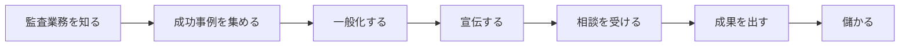

---
tags:
  - 監査業務
  - 業務効率化
  - 成功事例
  - コンサルティング
  - 提案資料
  - DX
  - ITコンサルティング
  - SWOT分析
---
# FRAME
フレームワークを設定します
## 1.WHY
- 監査業務におけるDXを成功させて儲ける
---
## 2.WHO/WHOM 
### 儲ける主体
1. グループの全体及び各社
2. 我々
### 儲け以外の恩恵を受けるのは誰か
1. 監査部門のスタッフ
2. 監査を受けるスタッフ　　
### 進行上の関係者は誰か　
- チームメンバー
## 3. HOW
以下のフローに基づく。

## 4.WHAT
- スライド30枚程度で資料を作る

## 5.WHEN
- （最短）11月の道場レポートに載せる
---

# Priority
D>C>Q
### Delivery
- 11月21日
### Cost 
工数の見積もり：15時間程度
1. 調査
	1. 資料集め：2時間
	2. 資料読み込み：3時間
2. アウトプットの構造化：5時間
3. アウトプットの作成：5時間
### Quality 
- 最低限：道場レポートに載せられるくらい
- 最大：DX企画部に売れるまたは監査部門に説明して回れる
## Measure
- 相談案件が3件くる
- すごいことになる
# Related
![[監査dX.base]]
